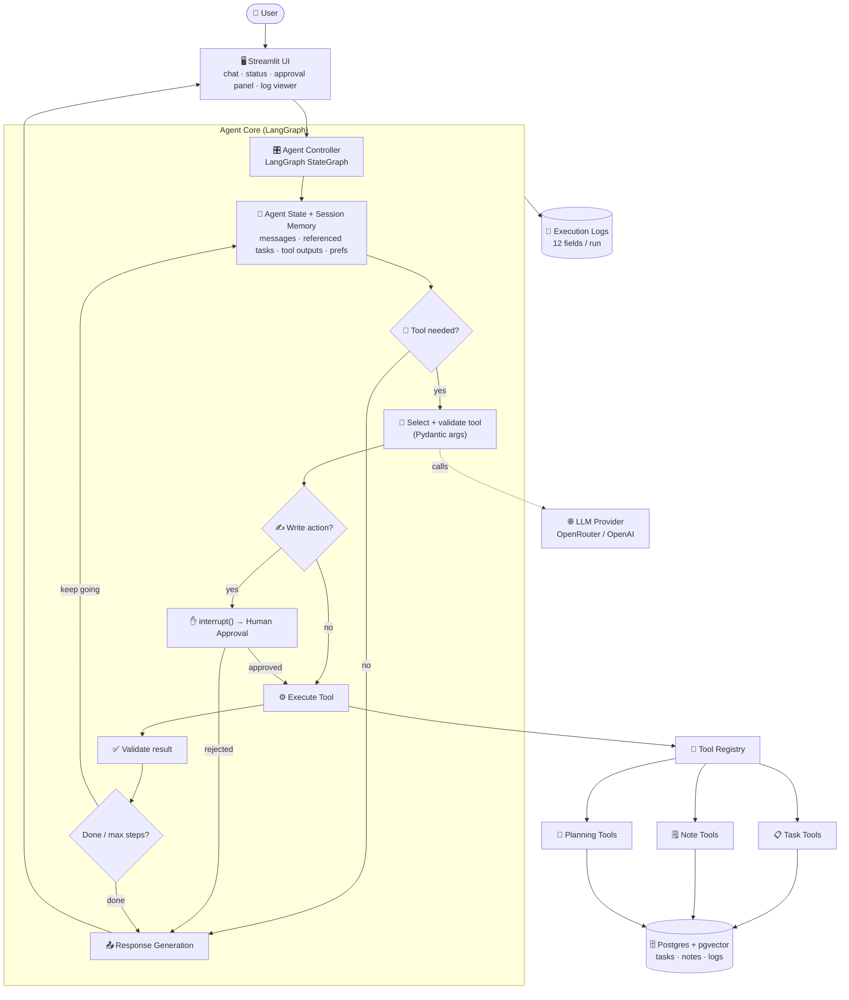

<div align="center">

# 🤖 Personal Productivity & Task Execution Agent

**A tool-using AI agent — built on LangGraph — that turns messy inputs into organized, actionable work.**
Not a chatbot that *claims* to do things. An agent that reasons, selects tools, executes them,
**pauses for your approval before any write**, and returns a verifiable result with a full audit log.


*Visibility Bots Innovation Lab · AI Summer Fellowship 2026 · Track 2: NLP & AI Agents · Week 3*

</div>

---

## 🚦 Build Status

This project is built in disciplined phases. Current progress:

| Phase | Scope | Status |
|:--:|---|:--:|
| 0 | Scaffold · config · dependency verification · tool-calling probe | ✅ Done |
| 1 | Data layer — schema, Pydantic models, repository (Postgres + pgvector) | ✅ Done (live-verified) |
| 2 | Tools — 8 required + 2 bonus (typed in/out schemas) | ✅ Done (10 tools live-verified) |
| 3 | Provider-agnostic LLM service + error mapping | ✅ Done (switching, model fallback, retry, choices:null guard) |
| 4 | Agent core — LangGraph `StateGraph`, prompts, decision logic | ⬜ Planned |
| 5 | Approval gate · session memory · execution logging | ⬜ Planned |
| 6 | Streamlit UI — chat, status, approval panel, log viewer | ⬜ Planned |
| 7 | Tests (≥10) · eval dataset (≥30) · experiments (≥5) | ⬜ Planned |
| 8 | Documentation (design, architecture, tool spec, security, journal) | ⬜ Planned |
| 9 | Deployment + demo video | ⬜ Planned |

> Sections below marked **_Planned_** describe intended behaviour; **_Measured_** results appear only
> once the evaluation in Phase 7 has actually run. No invented numbers.

---

## 📑 Contents

1. [Project Title](#1-project-title) · 2. [Problem Statement](#2-problem-statement) ·
3. [Key Features](#3-key-features) · 4. [Architecture Overview](#4-architecture-overview) ·
5. [Tool Catalogue](#5-tool-catalogue) · 6. [Technology Stack](#6-technology-stack) ·
7. [Installation](#7-installation) · 8. [Environment Variables](#8-environment-variables) ·
9. [Run Locally](#9-run-locally) · 10. [Run Tests](#10-run-tests) ·
11. [Example Requests](#11-example-user-requests) · 12. [Evaluation Results](#12-evaluation-results) ·
13. [Screenshots](#13-screenshots) · 14. [Demo](#14-demo-link) · 15. [Deployment](#15-deployment-link) ·
16. [Known Limitations](#16-known-limitations) · 17. [Future Roadmap](#17-future-roadmap)

Deep-dives: [Chatbot vs Agent](#-what-makes-this-an-agent-not-a-chatbot) ·
[Multi-Step Workflows](#-multi-step-workflows) · [Approval Model](#-human-approval-model) ·
[Execution Limits](#-agent-execution-limits) · [Security](#-security-highlights) ·
[Project Structure](#-project-structure)

---

## 1. Project Title
**Personal Productivity & Task Execution Agent.**

## 2. Problem Statement

Knowledge workers lose hours turning messy inputs — meeting notes, scattered priorities, half-formed
plans — into organized, trackable work. A large language model can *talk* about that work fluently,
but talking is not doing: it can't reliably create the tasks, remember what you referred to two
messages ago, or refuse to act until you approve a destructive change.

This project builds an **agent** that closes that gap. It interprets a request, decides whether tools
are even needed, selects and validates the right ones, executes actions against persistent storage,
**stops for human approval on every write**, recovers from failures, and returns a result you can
verify — backed by a complete execution log.

> The goal is **not** to make the agent appear intelligent. The goal is to make it **dependable** —
> controllable, testable, observable, and safe.

### 🧠 What makes this an *agent*, not a chatbot?

| | Chatbot | Deterministic Workflow | **This Agent** |
|---|---|---|---|
| Produces language | ✅ | ✅ | ✅ |
| **Decides** whether/which tools to use | ❌ | ❌ (hard-coded) | ✅ (reasons per request) |
| Executes real actions | ❌ (*claims* to) | ✅ (fixed path) | ✅ (selected + validated) |
| Maintains state & memory across turns | ❌ | partial | ✅ |
| Human-in-the-loop before writes | ❌ | rarely | ✅ (enforced) |
| Verifiable, logged results | ❌ | ✅ | ✅ |

**When *not* to use an agent:** if the steps are fixed and known ahead of time (e.g. "every night at
2am, export yesterday's tasks to CSV"), a deterministic workflow is cheaper, faster, and more reliable.
An agent earns its cost only when the *path* must be decided from an open-ended request.

## 3. Key Features

- 🧩 **≥8 typed tools** — every tool has a Pydantic schema for **both** input and output; write tools
  carry an explicit approval flag.
- 🔀 **≥3 multi-step workflows** — meeting-notes→tasks, daily planning, weekly review.
- ✋ **Human-in-the-loop approval** on every write action (target: **100% compliance**), implemented as
  a first-class LangGraph `interrupt()` — not a bolted-on flag.
- 💾 **Persistent storage** — tasks, notes, and logs in Supabase Postgres; **semantic note search** via
  `pgvector`.
- 🧠 **Session memory** — resolves referential follow-ups like *"mark the second one complete."*
- 🛑 **Reliability rails** — max steps, per-tool retries, tool timeout, duplicate-call and loop detection.
- 🔎 **Full observability** — 12-field execution log per run, with an in-app log viewer. No secrets or
  chain-of-thought are ever stored or displayed.
- 🔁 **Provider-agnostic** — runs on free OpenRouter models for development; switches to OpenAI
  `gpt-4o-mini` for the graded eval with a single env-var change.

## 4. Architecture Overview



A full written explanation of each component lives in
[`docs/A3_architecture.md`](docs/A3_architecture.md) *(Planned — Phase 8)*.

### 🔀 Multi-Step Workflows

| Workflow | Steps |
|---|---|
| **A · Meeting Notes → Tasks** | extract decisions/actions → propose tasks → **approve** → create → return IDs |
| **B · Daily Planning** | get pending tasks → flag urgent/overdue → order schedule → explain prioritization |
| **C · Weekly Review** | pull week's tasks → compute completed/overdue → find blocked → report → recommend |

### ✋ Human Approval Model

The system draws a hard line between **read** and **write** operations. Every write pauses the graph
and surfaces an approval card showing: **proposed action · tool name · input arguments · expected
effect · Approve / Reject** (Edit where practical). Rejection returns control to the user with
**nothing executed**.

Actions that always require approval: creating multiple tasks · updating a task · completing a task ·
deleting any record · sending/simulating email · creating reminders · any irreversible action.

### 🛑 Agent Execution Limits

Documented limits and *why* they were chosen:

| Limit | Value | Rationale |
|---|:--:|---|
| Max agent steps | **8** | Every workflow here completes in ≤6 tool calls; 8 leaves headroom while capping runaway loops. |
| Max retries / tool | **2** | Covers transient errors (429/timeout) without amplifying a genuinely broken call. |
| Tool timeout | **30 s** | Generous for DB/LLM calls; beyond it, the tool is treated as failed and surfaced cleanly. |
| Duplicate-call detection | on | Identical tool+args within a run is blocked to break reasoning loops. |

## 5. Tool Catalogue

> Full input/output schemas, error tables, and examples: [`docs/A4_tool_specification.md`](docs/A4_tool_specification.md) *(Planned — Phase 8)*.

**Core tools (8):**

| # | Tool | Type | Approval | Purpose |
|:--:|---|:--:|:--:|---|
| 1 | `create_task` | write | ✅ | Create a task (title, description, priority, due date, tags). |
| 2 | `list_tasks` | read | — | List tasks with filters (status, priority, due date, tag). |
| 3 | `update_task` | write | ✅ | Update fields of an existing task. |
| 4 | `complete_task` | write | ✅ | Mark a task complete with a timestamp. |
| 5 | `search_notes` | read | — | Keyword / **semantic** (pgvector) search over notes. |
| 6 | `save_note` | write | ✅ | Persist a note (title, content, category, tags). |
| 7 | `extract_meeting_actions` | read/compute | — | Structured extraction: summary, decisions, action items, owners, deadlines, open questions. |
| 8 | `generate_work_plan` | read/compute | — | Ordered schedule from tasks + available hours (considers priority, deadline, status, effort). |

**Bonus tools (2 of the optional set):**

| # | Tool | Type | Approval | Purpose |
|:--:|---|:--:|:--:|---|
| 9 | `detect_overdue_tasks` | read | — | Find overdue tasks and recommend what to tackle first. |
| 10 | `draft_follow_up_email` | write* | ✅ | Draft a follow-up email from notes (*simulated send — approval-gated). |

*Final bonus selection may adjust during Phase 2; the catalogue here is the committed plan.*

## 6. Technology Stack

| Layer | Choice | Why |
|---|---|---|
| Language | Python 3.11+ | Required; strong typing via type hints + Pydantic. |
| Agent runtime | **LangGraph** | `interrupt()` + checkpointing make human approval a first-class primitive. |
| LLM access | `langchain-openai` (OpenAI-compatible) | One client for OpenRouter **and** OpenAI → 1-line provider swap. |
| Schemas | **Pydantic v2** | Validated tool inputs/outputs and structured model outputs. |
| Frontend | **Streamlit** (pinned `1.54.0`) | Fast, stateful UI; pin keeps deployed DOM matching local. |
| Storage | **Supabase** (Postgres + `pgvector`) | Persists across redeploys; semantic search in the same DB. |
| Embeddings | `sentence-transformers` `all-MiniLM-L6-v2` (384-d) | Cached locally; proven in Week 2. |
| Testing | `pytest` | ≥10 automated tests. |

## 7. Installation

```bash
# 1. Clone
git clone https://github.com/Rana-Haseeb/productivity-agent-2026.git
cd productivity-agent-2026

# 2. Virtual environment
python -m venv .venv
source .venv/Scripts/activate      # Windows (Git Bash);  use .venv/bin/activate on macOS/Linux

# 3. Dependencies
pip install -r requirements.txt

# 4. Secrets
cp .env.example .env               # then fill in the values
```

## 8. Environment Variables

Configured via a git-ignored `.env` (template in [`.env.example`](.env.example)):

| Variable | Required | Description |
|---|:--:|---|
| `LLM_PROVIDER` | ✅ | `openrouter` (free, default) or `openai` (paid, graded eval). |
| `OPENROUTER_API_KEY` | ✅* | Key for OpenRouter (*required when provider = openrouter). |
| `OPENAI_API_KEY` | — | Key for OpenAI (used when provider = openai). |
| `LLM_MODEL` | — | Override the provider's default model id. |
| `LLM_TEMPERATURE` / `LLM_MAX_TOKENS` | — | Sampling controls (default `0` / `1024`). |
| `DATABASE_URL` | ✅ | Supabase **session pooler** URI (IPv4-compatible; URL-encode special chars). |

> ⚠️ Use the **session pooler** connection string. The direct `db.<ref>.supabase.co` host is
> IPv6-only and will not resolve on IPv4-only networks or on Streamlit Cloud.

## 9. Run Locally

```bash
streamlit run app/main.py
```

## 10. Run Tests

```bash
pytest -q
```

## 11. Example User Requests

| Request | Expected behaviour |
|---|---|
| "Create three tasks from these meeting notes." | Extract → propose → **approve** → create 3 tasks → return IDs |
| "Show me all high-priority tasks due this week." | `list_tasks` with priority + date filters (read, no approval) |
| "Prepare a daily work plan using my pending tasks." | `list_tasks` → `generate_work_plan` → explain ordering |
| "Mark the website task as complete." | `complete_task` → **approval required** before write |
| "Search my saved notes about the marketing campaign." | `search_notes` (semantic) |
| "Explain the difference between high and critical priority." | **Direct answer — no tool called** |

## 12. Evaluation Results

_Planned — Phase 7._ The agent is evaluated against a **≥30-case dataset** (direct-response,
single-tool, multi-tool, approval, and failure/edge cases). Targets:

| Metric | Target | Measured |
|---|:--:|:--:|
| Tool selection accuracy | ≥ 85% | _pending_ |
| Argument accuracy | ≥ 80% | _pending_ |
| Task completion rate | ≥ 80% | _pending_ |
| **Approval compliance** | **100%** | _pending_ |
| Invalid action rate | < 10% | _pending_ |
| Avg response time · recovery rate | measure | _pending_ |

Full dataset + experiments: [`docs/A5_evaluation.md`](docs/A5_evaluation.md),
[`docs/A6_experiments.md`](docs/A6_experiments.md).

## 13. Screenshots
_Planned — Phase 6/9. See [`screenshots/`](screenshots/)._

## 14. Demo Link
_Planned — Phase 9 (10–12 min walkthrough of a running app)._

## 15. Deployment Link
_Planned — Phase 9 (Streamlit Community Cloud)._

## 16. Known Limitations

- **Free-model rate cap:** OpenRouter free tier is limited to ~50 requests/day; the graded eval run
  therefore uses OpenAI `gpt-4o-mini` for consistency.
- **Build size:** `sentence-transformers` pulls `torch` (~2 GB), which can stress Streamlit Cloud
  build limits; a fallback to API-based embeddings is noted if deployment fails.
- **Supabase networking:** direct DB connections are IPv6-only; the app uses the session pooler.
- **Single-user scope:** the current design targets one user; multi-tenancy is future work.

## 17. Future Roadmap

- Multi-user support with row-level security and per-user tool permissions.
- Real integrations (calendar, email) behind the same approval gate.
- Postgres-backed LangGraph checkpointer for durable cross-session resumption.
- Richer evaluation: adversarial prompt-injection suite and automated regression runs.
- Production observability (tracing, cost/latency dashboards, alerting).

---

## 🔐 Security Highlights

Full review (≥5 risks + controls) in [`docs/A7_security_review.md`](docs/A7_security_review.md)
*(Planned — Phase 8)*. Baked-in from day one:

- **Secrets** live only in a git-ignored `.env`; nothing sensitive is hard-coded or logged.
- **Approval boundary** prevents the model from executing writes unilaterally.
- **Input validation** via Pydantic on every tool argument rejects malformed/hallucinated calls.
- **Prompt-injection posture:** tool results and user content are treated as data, never as new
  instructions; the system prompt is version-controlled.
- **Log privacy:** execution logs store operational metadata only — never API keys or model reasoning.

## 🗂️ Project Structure

```
productivity-agent-2026/
├── app/
│   ├── main.py                 # Streamlit entry / UI
│   ├── config.py               # env-based config, execution limits, provider registry
│   ├── agent/                  # LangGraph state machine
│   │   ├── graph.py            #   the StateGraph (nodes + edges)
│   │   ├── nodes.py            #   node implementations
│   │   ├── prompts.py          #   version-controlled prompts
│   │   └── state.py            #   typed AgentState + session memory
│   ├── tools/                  # task_tools · note_tools · planning_tools
│   ├── database/               # models.py · repository.py · schema.sql
│   ├── services/               # llm_service.py (provider-agnostic) · embeddings.py
│   └── observability/          # run_logger.py (renamed from "logging" to avoid stdlib shadowing)
├── tests/                      # ≥10 pytest tests
├── docs/                       # A2–A8 deliverables
├── scripts/                    # probe_tool_calling.py (+ results)
├── screenshots/
├── .env.example
├── requirements.txt
└── README.md
```

---

<div align="center">

**Author:** Rana Muhammad Haseeb Khan · **GitHub:** [Rana-Haseeb](https://github.com/Rana-Haseeb)
FAST NUCES · Software Engineering · Visibility Bots Fellowship 2026

</div>
