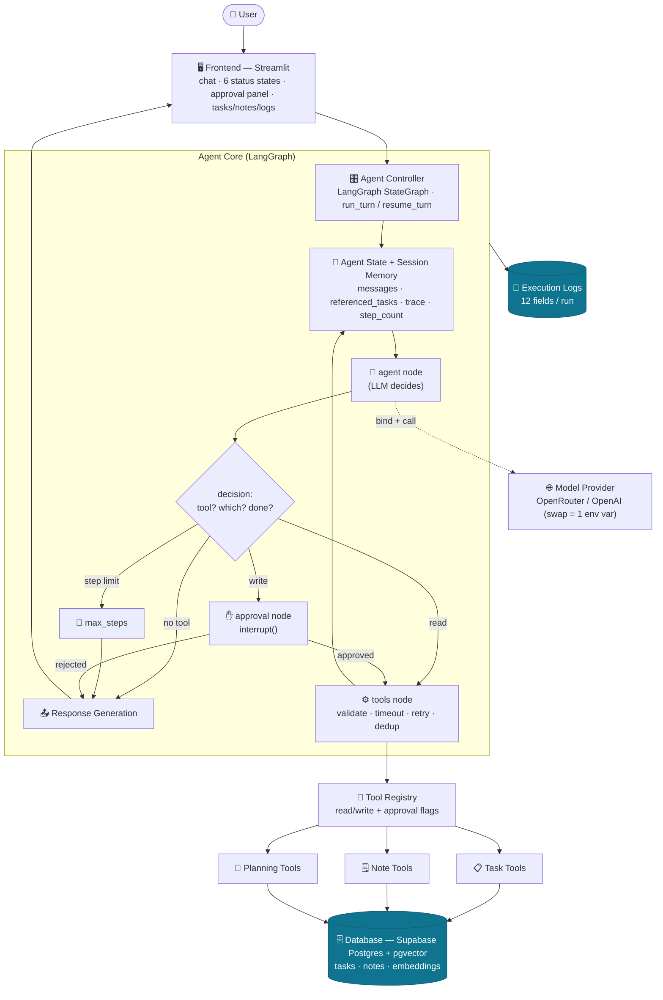

# A3 · Architecture

## Diagram

## Component explanations

**User → Frontend (Streamlit, [app/main.py](../app/main.py)).** The only human touchpoint. Renders the
conversation, the six operational **status states** (thinking → selecting tool → executing → waiting
for approval → final → error), the **approval panel** (approve/reject/edit), and tabbed live data
(Tasks / Notes / Logs). It never shows chain-of-thought, secrets, or stack traces. The compiled agent
and its checkpointer live in `st.session_state`, so the approval pause/resume survives Streamlit
reruns.

**Agent Controller (LangGraph `StateGraph`, [app/agent/graph.py](../app/agent/graph.py)).** Compiles the
nodes and edges into a stateful machine and exposes `run_turn` (new turn), `resume_turn` (after
approval), and `get_pending_interrupt`. A checkpointer makes every run resumable per `thread_id`.

**Agent State ([app/agent/state.py](../app/agent/state.py)).** The typed `TypedDict` flowing through the
graph — conversation history, referenced tasks (session memory), the per-tool trace, step counter,
and approval fields. See [A2 §7](A2_agent_design.md).

**agent node + decision logic ([app/agent/nodes.py](../app/agent/nodes.py)).** The agent node calls the
LLM (with tools bound) and returns its message. `route_after_agent` is the brain: no tool calls →
respond; step limit reached → stop; a write requested → approval; otherwise → execute.

**Model Provider ([app/services/llm_service.py](../app/services/llm_service.py)).** One provider-agnostic
service over any OpenAI-compatible endpoint. OpenRouter (free) today, OpenAI (`gpt-4o-mini`) for the
graded run — a single env var. Adds retry/backoff, a `choices: null` guard, friendly error mapping,
and a model fallback chain.

**Tool Registry ([app/tools/registry.py](../app/tools/registry.py)).** The single source of truth for the
ten tools and their **read/write + approval** flags. `run_tool` validates arguments (Pydantic) then
executes; the agent reads the flags to decide when to pause. Auto-generates the OpenAI tool schemas
the model is bound to.

**Task / Note / Planning tools.** The actual capabilities, each with typed input/output schemas
(see [A4](A4_tool_specification.md)). Planning's scheduler and overdue detector are deterministic.

**Database (Supabase Postgres + pgvector, [app/database/repository.py](../app/database/repository.py)).**
Durable storage for tasks, notes (with 384-d embeddings for semantic search), and execution logs.
Accessed only through the typed repository — callers never touch SQL. Reached via the IPv4 session
pooler.

**Execution Logs ([app/observability/run_logger.py](../app/observability/run_logger.py)).** Every run is
recorded with 12 fields (request, model, tools, args, results, approval status, errors, timing,
outcome) — no secrets or reasoning — and shown in the UI's Logs tab.

## Cross-cutting concerns

- **Human approval:** the `approval` node (`interrupt()`), between decision and execution of writes.
- **Error handling:** friendly mapping in the LLM service; per-tool try/except with timeout + retry
  in the tools node; typed not-found/validation errors from the repository.
- **Session memory:** `messages` + `referenced_tasks` in state, persisted by the checkpointer.
- **Observability:** the per-tool `trace` accumulated in state → the 12-field execution log.
